# 👋 Привет, я Станислав  
Python-разработчик, специализирующийся на создании Telegram-ботов, автоматизации HR-процессов, интеграциях с CRM/внешними API и сервисах на базе AI (GPT, Whisper).

Работаю с реальными бизнес-кейсами: документооборот, партнёрские программы, аналитика, генерация коммерческих предложений, классификация запросов, обработка аудио, интеграции с HRlink и Bitrix24 иными.

---

## 🚀 Технологии и инструменты
- **Python 3.10+**
- **Aiogram / Asyncio**
- **FastAPI / Flask**
- **SQLAlchemy / PostgreSQL / SQLite**
- **Docker / docker-compose**
- **Bitrix24 API / HRlink API / внешние REST-сервисы**
- **Whisper / GPT-модели / OpenAI API**
- **python-docx, LibreOffice, шаблоны документов**
- **Pandas / визуализация данных**

---

# 📂 Избранные проекты

## 🔹 Calculator TG HRlink — калькулятор экономии КЭДО  
📎 **GitHub:** https://github.com/Stanislav-Kankin/calculator_tg_hrlink_portfolio  
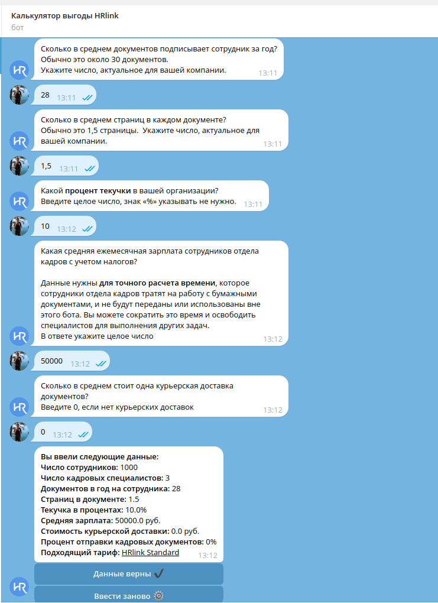
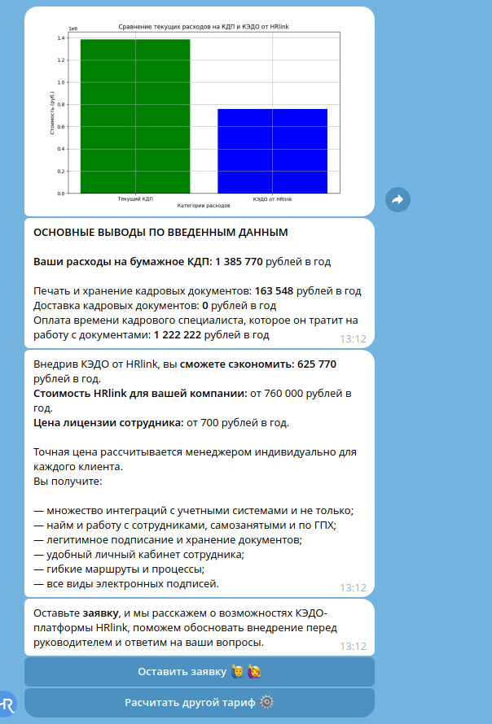

**Что делает:**  
Телеграм-бот рассчитывает экономию от перехода на КЭДО, строит графики, сохраняет результаты в БД, делает рассылки.

**Стек:** Python, aiogram, SQLAlchemy, Matplotlib, Docker  
**Ключевое:** FSM-логика, графики ROI, сохранение истории расчётов.

---

## 🔹 HRlink КП-Генератор — создание коммерческих предложений  
📎 **GitHub:** https://github.com/Stanislav-Kankin/hrl_partner_porfolio
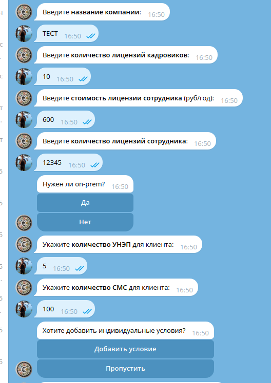
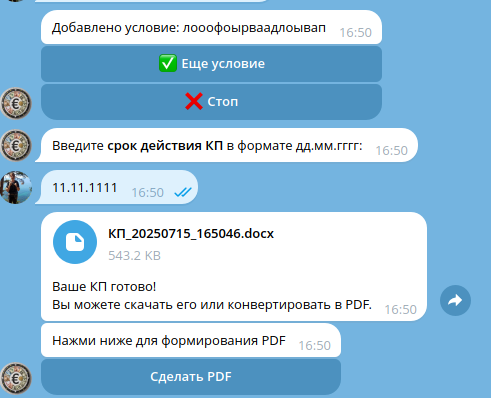

**Что делает:**  
Генерирует коммерческие предложения (.docx + .pdf) на основе шаблонов и вводимых пользователем данных.

**Стек:** Python, aiogram, python-docx, LibreOffice  
**Ключевое:** работа с шаблонами, конвертация docx → pdf, управление файлами.

---

## 🔹 Partner Bot (DealReg, Bitrix24)  
📎 **GitHub:** https://github.com/Stanislav-Kankin/hrl_partner_porfolio 

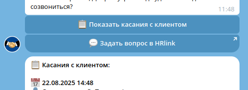

**Что делает:**  
Партнёрский Telegram-бот: заявки, проверка доменов, стадии сделок, аналитика и интеграция с Bitrix24.

**Стек:** Python, aiogram, Bitrix24 API  
**Ключевое:** разграничение ролей, CRM-интеграция, логирование изменений.

---

## 🔹 Random Coffee Bot  
📎 **GitHub:** https://github.com/Stanislav-Kankin/koffeebot_sb_portfolio  
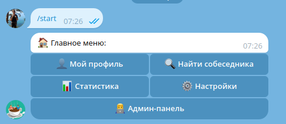

**Что делает:**  
Организует случайные «кофе-встречи» между сотрудниками для нетворкинга.

**Стек:** Python, aiogram  
**Ключевое:** алгоритм мэтчинга, админ-панель, напоминания.

---

## 🔹 Helper Bot (ofdata API)  
📎 **GitHub:** https://github.com/Stanislav-Kankin/hepler_bot_portfolio/  

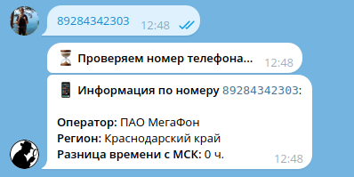

**Что делает:**  
Проверяет телефоны, регионы, часовые пояса, компании по ИНН через API ofdata.ru.

**Стек:** Python, aiogram, внешние API  
**Ключевое:** быстрые справочные запросы, универсальная архитектура.

---

## 🔹 HRlink Base — классификация текстов и база знаний  
📎 **GitHub:** https://github.com/Stanislav-Kankin/base_hrlink_portfolio/  

**Что делает:**  
Классифицирует сообщения и подбирает ответы из базы знаний через систему ролей и промптов.

**Стек:** Python, aiogram, GPT  
**Ключевое:** LLM-основы, роли, гибкая настройка подсказок.

---

## 🔹 HRlink Dashboard  
📎 **GitHub:** https://github.com/Stanislav-Kankin/hrl_dash_portfolio/
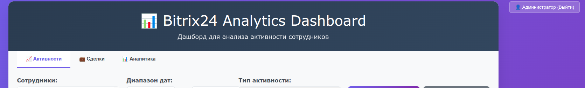
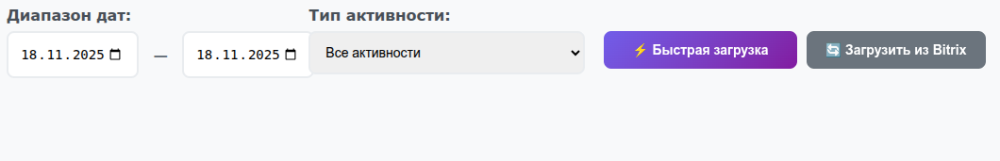
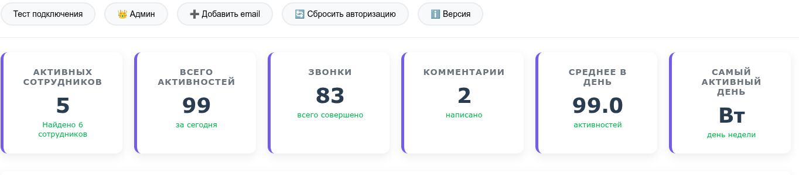
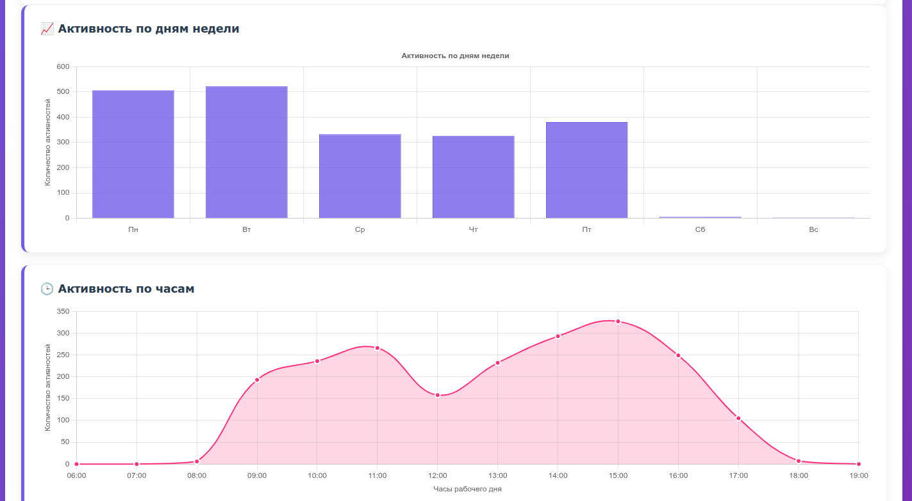
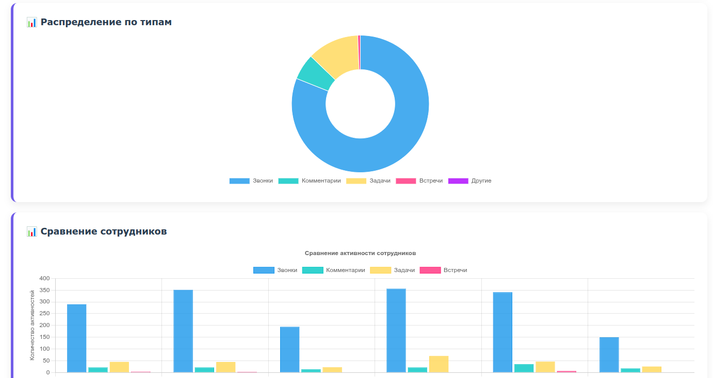
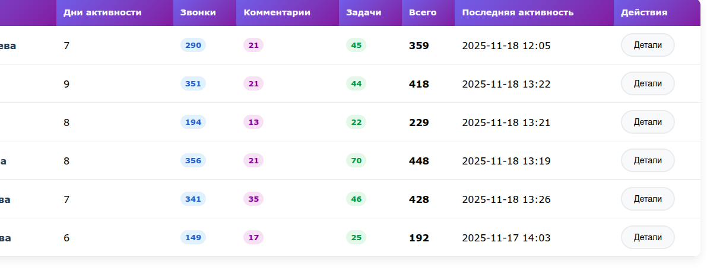

**Что делает:**  
Визуализирует данные HRlink: KPI, заявки, активность.

**Стек:** Streamlit / Dash / Python  
**Ключевое:** аналитика данных, визуализация, отчёты.

---

## 🔹 GPT + Whisper Assistant  
📎 **GitHub:** https://github.com/Stanislav-Kankin/gpt_wisper_portfolio 
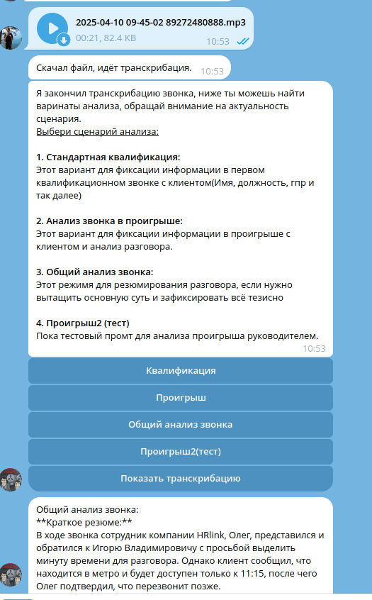

**Что делает:**  
Принимает аудио, расшифровывает Whisper-моделью и передаёт распознанный текст в GPT для анализа/резюме.

**Стек:** Python, Whisper, OpenAI GPT, FastAPI  
**Ключевое:** поток аудио → текст → интеллект-обработка.

---

# 🧩 Чем могу быть полезен
- Разработка Telegram-ботов «под ключ»  
- Встраивание в бизнес-процессы (HR, документооборот, CRM)  
- Интеграции с API (Bitrix, HRlink, любые REST-сервисы)  
- Whisper/GPT-автоматизация  
- Генерация документов и корпоративные инструменты  
- Внутренние сервисы и аналитика

---

# 📬 Контакты
- **Telegram:** @Stanislav_KRD_89
- **Email:** stanisalv.kankin@mail.ru 
- **GitHub:** https://github.com/Stanislav-Kankin

---
